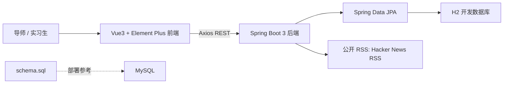
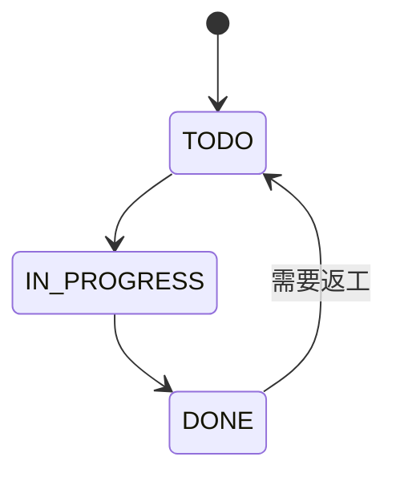

# InternTaskHub 设计文档

## 1. 系统架构

系统采用前后端分离。前端负责登录态保存、视图切换、表单交互、图表展示和 CSV 导出；后端负责任务权限、业务校验、数据持久化、资讯抓取和统计聚合。

## 2. 数据库表设计

| 表 | 关键字段 | 说明 |
| --- | --- | --- |
| `app_users` | `id`, `username`, `display_name`, `role`, `avatar_color` | 用户与角色。角色为 `MENTOR` 或 `INTERN` |
| `tasks` | `title`, `description`, `status`, `priority`, `assignee_id`, `creator_id`, `due_date` | 任务主体，支持负责人、创建人、状态、优先级、截止日 |
| `news_items` | `title`, `summary`, `link`, `source`, `keyword`, `published_at`, `fetched_at` | RSS 资讯缓存，按链接去重 |

任务状态流转：

## 3. 核心 API

| Method | API | 请求/参数 | 返回 |
| --- | --- | --- | --- |
| POST | `/api/auth/mock-login` | `username` | 当前用户和 mock token |
| GET | `/api/tasks` | `status`, `assigneeId`, `keyword`, `dueBefore` | 当前用户可见任务 |
| POST | `/api/tasks` | 任务表单 | 新任务 |
| PUT | `/api/tasks/{id}` | 任务表单 | 更新后的任务 |
| PATCH | `/api/tasks/{id}/status` | `status` | 更新后的任务 |
| GET | `/api/dashboard/summary` | Header `X-User-Id` | 状态计数、完成率、临期/逾期 |
| GET | `/api/news` | `keyword` | 资讯列表 |
| GET | `/api/news/related` | `keyword` | 任务相关资讯 |
| POST | `/api/news/refresh` | `keyword` | 刷新后的资讯 |

权限策略：导师可查看所有任务；实习生只可查看、修改和删除自己负责的任务。MVP 使用 `X-User-Id` 请求头识别当前用户，避免在 48 小时任务中投入过多 JWT 细节。

## 4. 技术选型理由

- Spring Boot 3 + JPA：快速完成 REST API、实体建模和持久化，代码结构清晰。
- H2：开发和评审启动成本低；同时提供 MySQL 版 `schema.sql`，方便迁移。
- Vue3 + Vite：启动快，Composition API 适合组织复杂页面状态。
- Element Plus：表格、弹窗、表单、标签和加载态完善，适合管理后台。
- ECharts：用于完成率和状态统计，展示性强。
- RSS 资讯：不依赖 API Key，降低演示失败风险。

## 5. AI 工具使用说明

本项目使用 Codex + ChatGPT 辅助完成需求拆解、接口设计、代码生成和文档整理。验证方式包括：

- 对照题目逐项检查功能覆盖情况。
- 前端执行 `npm run build`，确认 Vue 模板和依赖可构建。
- 后端按分层结构审查 Controller、Service、Repository、Entity，避免把业务逻辑堆在 Controller。
- 对 AI 生成内容进行人工取舍：登录采用 Mock 而非完整 JWT，资讯采用 RSS 而非需 Key 的 API，保证 MVP 更稳。

## 6. 遇到的问题与解决思路

| 问题 | 现象 | 解决 |
| --- | --- | --- |
| Spring Initializr 默认生成 Spring Boot 4.1 | 与题目要求 Spring Boot 3.x 不一致 | 手动将 `pom.xml` 调整为 Spring Boot `3.3.6`，并改回 Boot 3 的 `spring-boot-starter-web` |
| 本机环境未找到 Java/Maven | 无法在当前机器直接编译后端 | 保留 Maven Wrapper，README 明确需要 JDK 17；前端已完成构建验证 |
| `rg --files` 权限失败 | 文件扫描报 `Access is denied` | 改用 PowerShell `Get-ChildItem` |
| 资讯 API Key 风险 | 第三方 API 可能需要密钥或限流 | 改用公开 RSS，并提供本地种子资讯兜底 |

## 7. 截图清单

最终提交前建议补充以下截图到邮件或文档中：

- 登录页
- 导师视角任务列表
- 实习生视角任务列表
- 任务详情弹窗中的相关资讯
- ECharts 仪表盘
- RSS 刷新结果
- 启动或构建中遇到的问题及修复记录
